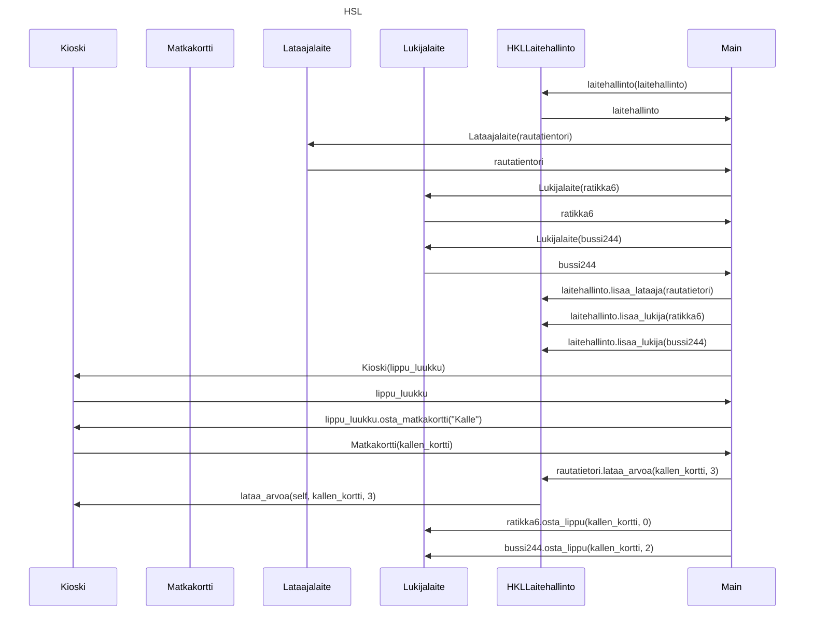

```mermaid
---
title: HSL
---
sequenceDiagram
    participant Kioski
    participant Matkakortti
    participant Lataajalaite
    participant Lukijalaite
    participant HKLLaitehallinto
    participant Main
    Main->>HKLLaitehallinto: laitehallinto(laitehallinto)
    HKLLaitehallinto->>Main: laitehallinto
    Main->>Lataajalaite: Lataajalaite(rautatientori)
    Lataajalaite->>Main: rautatientori
    Main->>Lukijalaite: Lukijalaite(ratikka6)
    Lukijalaite->>Main: ratikka6
    Main->>Lukijalaite: Lukijalaite(bussi244)
    Lukijalaite->>Main: bussi244
    Main->>HKLLaitehallinto: laitehallinto.lisaa_lataaja(rautatietori)
    Main->>HKLLaitehallinto: laitehallinto.lisaa_lukija(ratikka6)
    Main->>HKLLaitehallinto: laitehallinto.lisaa_lukija(bussi244)
    Main->>Kioski: Kioski(lippu_luukku)
    Kioski->>Main: lippu_luukku
    Main->>Kioski: lippu_luukku.osta_matkakortti("Kalle")
    Kioski->>Main: Matkakortti(kallen_kortti)
    Main->>HKLLaitehallinto: rautatietori.lataa_arvoa(kallen_kortti, 3)
    HKLLaitehallinto->>Kioski: lataa_arvoa(self, kallen_kortti, 3)
    Main->>Lukijalaite: ratikka6.osta_lippu(kallen_kortti, 0)
    Main->>Lukijalaite:bussi244.osta_lippu(kallen_kortti, 2)

```