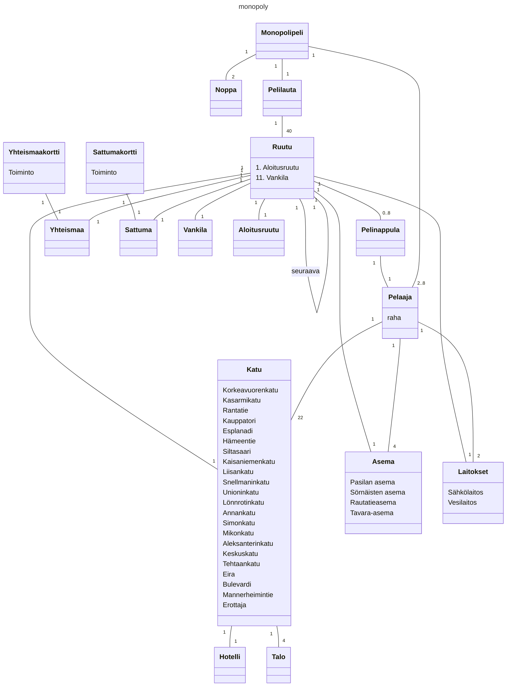

## Monopoli, alustava luokkakaavio

```mermaid
---
title: monopoly 
---
  classDiagram
    Monopolipeli "1" -- "2" Noppa
    Monopolipeli "1" -- "1" Pelilauta
    Pelilauta "1" -- "40" Ruutu
    Ruutu "1" -- "1" Ruutu : seuraava
    Ruutu "1" -- "0..8" Pelinappula
    Pelinappula "1" -- "1" Pelaaja
    Pelaaja "2..8" -- "1" Monopolipeli
    Yhteismaakortti "1" -- "1" Yhteismaa
    Ruutu "1" -- "1" Yhteismaa
    Sattumakortti "1" -- "1" Sattuma
    Ruutu "1" -- "1" Sattuma
    Ruutu "1" -- "1" Katu
    Katu "1" -- "1" Hotelli
    Katu "1" -- "4" Talo
    Pelaaja "1" -- "22" Katu
    Ruutu "1" -- "1" Vankila
    Ruutu "1" -- "1" Aloitusruutu
    Ruutu "1" -- "1" Asema
    Ruutu "1" -- "1" Laitokset
    Pelaaja "1" -- "2" Laitokset
    Pelaaja "1" -- "4" Asema

    class Pelaaja{
        raha
    }
    class Katu{
        Korkeavuorenkatu
        Kasarmikatu
        Rantatie
        Kauppatori
        Esplanadi
        Hämeentie
        Siltasaari
        Kaisaniemenkatu
        Liisankatu
        Snellmaninkatu
        Unioninkatu
        Lönnrotinkatu
        Annankatu
        Simonkatu
        Mikonkatu
        Aleksanterinkatu
        Keskuskatu
        Tehtaankatu
        Eira
        Bulevardi
        Mannerheimintie
        Erottaja
    }
    class Asema{
        Pasilan asema
        Sörnäisten asema
        Rautatieasema
        Tavara-asema
    }
    class Laitokset{
        Sähkölaitos
        Vesilaitos
    }
    class Ruutu{
        1. Aloitusruutu
        11. Vankila
    }
    class Yhteismaakortti{
        Toiminto
    }
    class Sattumakortti{
        Toiminto
    }
```