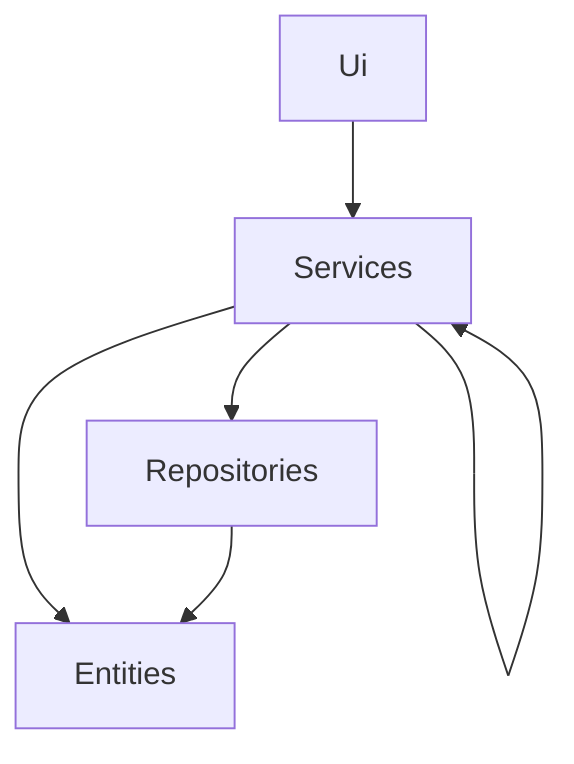
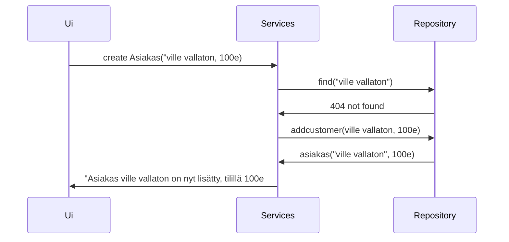

## Arkkitehtuurikuvaus
### Rakenne

Ohjelman rakenne noudattelee perinteistä ui, services, entities, repositories arkkitehtuuria.

### Käyttöliittymä

Käyttöliittymä on vielä Index.py tasolla

### Tiedon tallennus

tiedot tallennetaan kahteen eri csv tiedostoon asiakas.csv ja asiakashistoria.csv tiedostoihin. asiakas.csv tiedostossa on tiedot nykyisistä asiakkaista ja heidän tiliensä arvosta. Asiakashistoria.csv tiedostossa on tiedot tallennettu viime vuotisista asiakkaiden tiedoista, nimestä ja tilin arvosta.

### Päätoiminnallisuudet

Osiossa sekvenssikaaviolla esitettynä tiettyjä toiminnallisuuksia

#### Asiakkaan hakeminen

Asiakkaan löytäminen toimii seuraavalla periaatteella:

### Ohjelman rakenteeseen jääneet heikkoudet

Käyttöliittymä vielä tekemättä